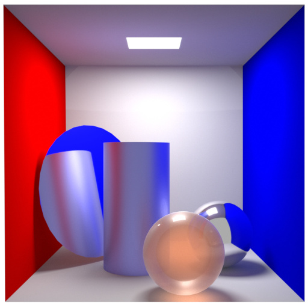
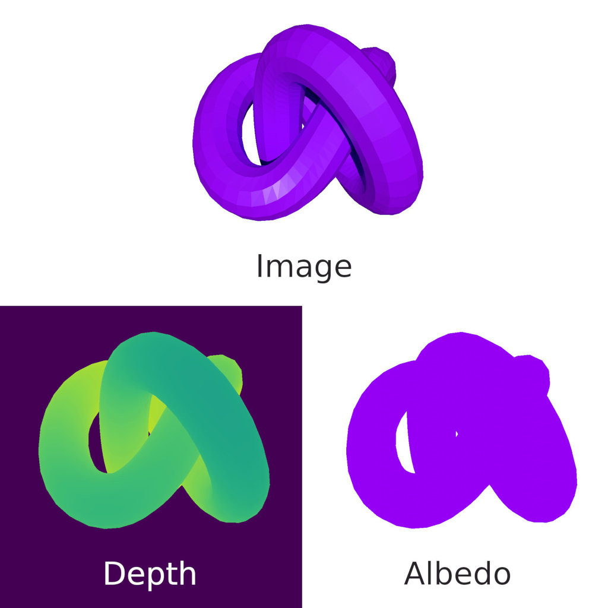
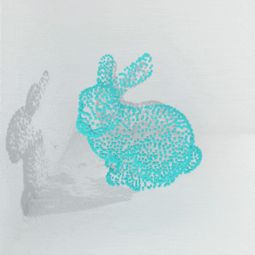
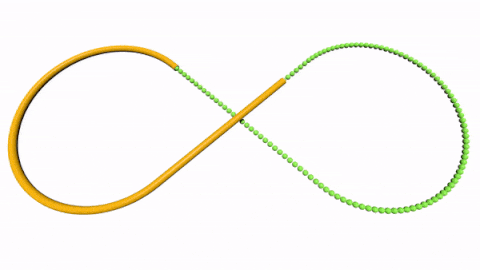

<picture>
  <source media="(prefers-color-scheme: dark)" srcset="./docs/_static/logo/blendify_logo_dark_bg.png">
  
</picture>

<p align="center">
    <a href="https://arxiv.org/abs/2410.17858">
        
    </a>
    &emsp;
    <a href="https://colab.research.google.com/github/ptrvilya/blendify/blob/main/examples/ipynb/blendify_colab_demo.ipynb">
        
    </a>
    &emsp;  
    <a href="https://virtualhumans.mpi-inf.mpg.de/blendify/index.html">
        
    </a>
    &emsp;  
    <a href="https://pypi.org/project/blendify/">
        
    </a>   
    &emsp;
    <a href="https://www.gnu.org/licenses/gpl-3.0.html">
        
    </a>
</p>

## Introduction
Blendify is a lightweight Python framework that provides a high-level API for creating and rendering scenes with Blender. Developed with a focus on 3D computer vision visualization, Blendify simplifies access to selected Blender functions and objects.

Key features of Blendify:

1. **Simple interface:** Blendify provides a user-friendly interface for performing common visualization tasks without having to dive into the complicated Blender API.

2. **Easy integration:** Blendify seamlessly integrates with development scripts, implementing
commonly used routines and functions:
    * native support of point clouds, meshes, and primitives;
    * support of per-vertex colors and textures;
    * advanced shadows with shadow catcher objects;
    * video rendering with smooth camera trajectories;
    * support for common camera models;
    * import and export of .blend files for deeper integration with Blender;
    * per-face definition of materials for meshes;
    * support for common rotation representations and look-at utility to automatically setup orientation.
3. **Quick start:** Blendify is easy to get started with and does not require a standalone Blender installation. All you need to do is run `pip install blendify`.

4. **Blendify works in Colab:** check out [our Google Colab demo](https://colab.research.google.com/github/ptrvilya/blendify/blob/main/examples/ipynb/blendify_colab_demo.ipynb)!

## Installation instructions
Please note: **Blendify requires Python 3.10**
### Install from pip
```bash
pip install blendify
```
### Optional requirements
```bash
pip install blendify[utils / examples / docs / all]
```

Running examples 4 and 5 requires [PyTorch](https://pytorch.org/) with [PyTorch3D](https://github.com/facebookresearch/pytorch3d/blob/main/INSTALL.md).

Running example 5 requires SMPL model files, please refer to the installation instructions in 
[README](https://github.com/vchoutas/smplx#downloading-the-model).


## Quick Start
```python
# Script to render cube
from blendify import scene
from blendify.materials import PrincipledBSDFMaterial
from blendify.colors import UniformColors
# Add light
scene.lights.add_point(strength=1000, translation=(4, -2, 4))
# Add camera
scene.set_perspective_camera((512, 512), fov_x=0.7, rotation=(0.82, 0.42, 0.18, 0.34), translation=(5, -5, 5))
# Create material
material = PrincipledBSDFMaterial()
# Create color
color = UniformColors((0.0, 1.0, 0.0))
# Add cube mesh
scene.renderables.add_cube_mesh(1.0, material, color)
# Render scene
scene.render(filepath="cube.png")
```


## Examples
<table>
  <tr align="center">
    <td><a href="examples/01_cornell_box.py"><b>Cornell Box</b></a></td>
    <td><a href="examples/02_color_albedo_depth.py"><b>Color, albedo and depth</b></a></td>
  </tr>
  <tr align="center">
    <td></td>
    <td></td>
  </tr>
  <tr align="center">
    <td><a href="examples/03_mesh_with_texture.py"><b>Mesh with texture</b></a></td>
    <td><a href="examples/04_camera_colored_point_cloud.py"><b>Camera colored point cloud</b></a></td>
  </tr>
  <tr align="center">
    <td></td>
    <td></td>
  </tr>
  <tr align="center">
    <td><a href="examples/05_smpl_movement.py"><b>SMPL movement</b></a></td>
    <td><a href="examples/06_nurbs_trajectory.py"><b>NURBS trajectory</b></a></td>
  </tr>
  <tr align="center">
    <td></td>
    <td></td>
  </tr>
  <tr align="center">
    <td><a href="examples/07_materials_and_shadow_catcher.py"><b>Various materials and shadow catcher</b></a></td>
    <td><a href="examples/08_per_face_material.py"><b>Per-face material</b></a></td>
  </tr>
  <tr align="center">
    <td></td>
    <td></td>
  </tr>
</table>


## Changelog
The most recent version of blendify is **2.0.0**. The update introduced some breaking changes that are
summarized alongside the overview of the new features in the [CHANGELOG](CHANGELOG.md) file.

## Citation
If you use Blendify in your research, please cite:
```bibtex
@article{blendify2024,
  title={Blendify -- Python rendering framework for Blender},
  author={Guzov, Vladimir and Petrov, Ilya A and Pons-Moll, Gerard},
  journal={arXiv preprint arXiv:2410.17858},
  year={2024}
}
```


## Works that use blendify
* V. Lazova, E. Insafutdinov, G. Pons-Moll: [360-Degree Textures of People in Clothing from a Single Image](https://virtualhumans.mpi-inf.mpg.de/360tex/)
in 3DV'19
* B.L. Bhatnagar, X. Xie, **I. Petrov**, C. Sminchisescu, C. Theobalt, G. Pons-Moll: 
  [BEHAVE: Dataset and Method for Tracking Human Object Interactions](https://virtualhumans.mpi-inf.mpg.de/behave/), in CVPR'22
* X. Zhang, B.L. Bhatnagar, **V. Guzov**, S. Starke, G. Pons-Moll: 
  [COUCH: Towards Controllable Human-Chair Interactions](https://virtualhumans.mpi-inf.mpg.de/couch/), in ECCV'22
* G. Tiwari, D. Antic, J. E. Lenssen, N. Sarafianos, T. Tung, G. Pons-Moll: [Pose-NDF: 
Modeling Human Pose Manifolds with Neural Distance Fields](https://virtualhumans.mpi-inf.mpg.de/posendf/), in ECCV'22
* **I. Petrov**, R. Marin, J. Chibane, G. Pons-Moll: [Object pop-up: Can we infer 3D objects and their poses from human interactions alone?](https://virtualhumans.mpi-inf.mpg.de/object_popup/), in CVPR'23

## Contributors
Blendify is written and maintained by [Vladimir Guzov](https://github.com/vguzov) and [Ilya Petrov](https://github.com/ptrvilya).


## Acknowledgments
We thank Verica Lazova for providing her Blender rendering scripts, 
[István Sarandi](https://github.com/isarandi) for his suggestions and help in implementing new features, 
and [Riccardo Marin](https://github.com/riccardomarin) for his helpful suggestions and feedback.
Our code for processing point clouds is mostly based on the amazing [Blender-Photogrammetry-Importer][BPI] addon.


## License
The code is released under the [GNU General Public License v3][GNU GPL v3].

The Python logo is trademark of Python Software Foundation.
The Blender logo is a registered property of Blender Foundation.
[Blender-Photogrammetry-Importer][BPI] is distributed under the [MIT License][BPI license]. 
Blender is released under the [GNU General Public License v3][GNU GPL v3]. 

[GNU GPL v3]: https://www.gnu.org/licenses/gpl-3.0.html
[BPI]: https://github.com/SBCV/Blender-Addon-Photogrammetry-Importer
[BPI license]: https://github.com/SBCV/Blender-Addon-Photogrammetry-Importer/blob/master/README.md
