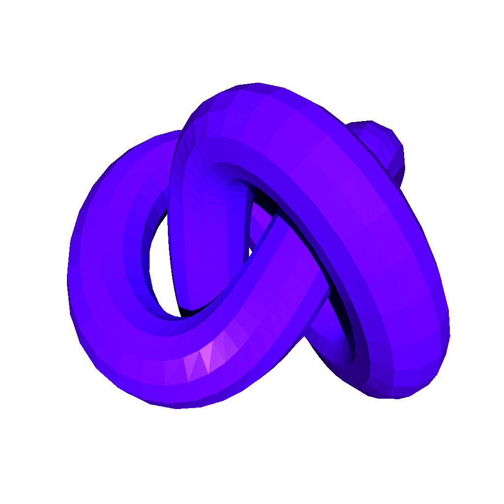

## Examples
<table>
  <tr align="center">
    <td>[**Color, albedo and depth**](examples/01_render_color_albedo_depth.py)</td>
    <td>[**Cornell Box**](examples/02_cornell_box.py)</td>
  </tr>
  <tr align="center">
    <td>
      
    </td>
    <td>
      
    </td>
  </tr>
  <tr align="center">
    <td>[**Mesh with texture**](examples/03_render_with_texture.py)</td>
    <td>[**Camera colored point cloud**](examples/04_camera_colored_point_cloud.py)</td>
  </tr>
  <tr align="center">
    <td>
      
    </td>
    <td>
      
    </td>
  </tr>
</table>

## Acknowledgment
We thank Verica Lazova for providing her Blender rendering scripts. Our code for processing point clouds is mostly based on the amazing [Blender-Photogrammetry-Importer](https://github.com/SBCV/Blender-Addon-Photogrammetry-Importer) addon.
